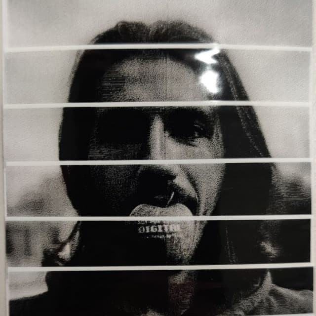

# Richard the printer :printer:

A Telegram bot developped to recieve requests to print text, images and qrcodes on a Brother T900 labeling machine.

Example of image being printed:

### Requested image

### Printed image

This project is a mix of [labelprinterkit](https://github.com/NotAFile/labelprinterkit) and [py-brotherlabel](https://github.com/masatomizuta/py-brotherlabel)